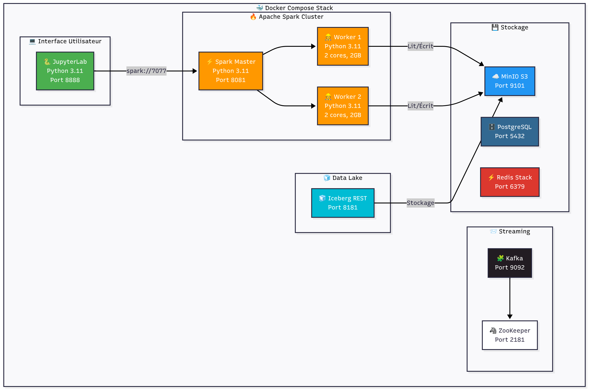

# mkadia-reco

Real-time recommendation system using Apache Spark, Kafka, and Machine Learning for sentiment analysis.

## 🏗️ Architecture



A distributed streaming data pipeline that processes product reviews in real-time, analyzes sentiment using BERT models, and provides intelligent recommendations.

## 🚀 Quick Start

```bash
# Start all services
cd spark
docker-compose up -d

# Verify services are running
docker ps

# Run sentiment analysis test
docker exec -it spark-master spark-submit \
  --packages com.johnsnowlabs.nlp:spark-nlp_2.12:5.3.2 \
  --conf spark.kryoserializer.buffer.max=512m \
  --driver-memory 4g \
  --executor-memory 4g \
  --master spark://spark-master:7077 \
  /opt/spark-apps/Tests/test_sentiment_model.py
```

## 📁 Project Structure

```
mkadia-reco/
├── spark/                      # Spark applications and configurations
│   ├── apps/                   # PySpark applications
│   │   ├── streaming.py        # Kafka stream processor
│   │   ├── streaming_with_sentiment.py  # Sentiment analysis pipeline
│   │   ├── model/              # Pre-trained NLP models
│   │   └── Tests/              # Test scripts
│   ├── Dockerfile              # Spark container image
│   └── docker-compose.yml      # Multi-container orchestration
├── data/                       # Sample datasets
├── airflow/                    # Workflow orchestration (optional)
├── jupyter/                    # Jupyter notebooks
├── docs/                       # Documentation
│   ├── DOCKER_BUILD_FIX.md     # Docker troubleshooting
│   ├── MODEL_OPTIMIZATION_GUIDE.md  # Performance tuning
│   └── HF_TO_SPARK_NLP_CONVERSION.md  # Model conversion guide
└── README.md                   # This file
```

## 🛠️ Tech Stack

- **Stream Processing**: Apache Spark 3.5.0, Kafka
- **NLP**: Spark NLP 5.3.2, BERT (Multilingual Sentiment)
- **Orchestration**: Docker Compose
- **Language**: Python 3.8

## 📊 Features

- ✅ Real-time Kafka stream processing
- ✅ Multilingual sentiment analysis (EN, FR, DE, ES, IT, NL)
- ✅ Distributed Spark cluster (1 master + 2 workers)
- ✅ Pre-trained BERT models for high accuracy
- ✅ Docker containerization for easy deployment
- ✅ Scalable architecture

## 🧪 Running Tests

```bash
# Test Kafka connectivity
docker exec -it spark-master python /opt/spark-apps/Tests/test_nlp_model_comprehensive.py

# Test sentiment model
docker exec -it spark-master spark-submit \
  --packages com.johnsnowlabs.nlp:spark-nlp_2.12:5.3.2 \
  --master spark://spark-master:7077 \
  /opt/spark-apps/Tests/test_sentiment_model.py
```

## 📖 Documentation

- [Quick Start Guide](QUICK_START.md)
- [Docker Build Troubleshooting](docs/DOCKER_BUILD_FIX.md)
- [Model Optimization Guide](docs/MODEL_OPTIMIZATION_GUIDE.md)
- [Setup Complete Checklist](SETUP_COMPLETE.md)

## 🔧 Configuration

### Spark Cluster
- **Master**: `spark://spark-master:7077`
- **Master UI**: http://localhost:8081
- **Worker 1 UI**: http://localhost:8082
- **Worker 2 UI**: http://localhost:8083

### Kafka
- **Bootstrap Servers**: `localhost:9092`
- **UI**: http://localhost:8085

### Services Ports
- Spark Master: 7077, 8081
- Kafka: 9092, 29092
- Kafka UI: 8085
- Zookeeper: 2181

## 🚦 Workflow

1. **Data Ingestion**: Product reviews streamed via Kafka
2. **Stream Processing**: Spark consumes Kafka topics
3. **Sentiment Analysis**: BERT model classifies reviews (1-5 stars)
4. **Results**: Processed data stored/forwarded for recommendations

## 📝 Model Information

- **Model**: bert_sequence_classifier_multilingual_sentiment
- **Size**: ~670MB
- **Languages**: English, French, German, Spanish, Italian, Dutch
- **Accuracy**: 67% exact match, 95% off-by-1 match
- **Inference**: ~0.5-2s per review (optimized)

## 🤝 Contributing

1. Fork the repository
2. Create a feature branch
3. Make your changes
4. Submit a pull request

## 📄 License

This project is part of an academic research project.

## 🔗 References

- [Apache Spark](https://spark.apache.org/)
- [Spark NLP](https://nlp.johnsnowlabs.com/)
- [Apache Kafka](https://kafka.apache.org/)
