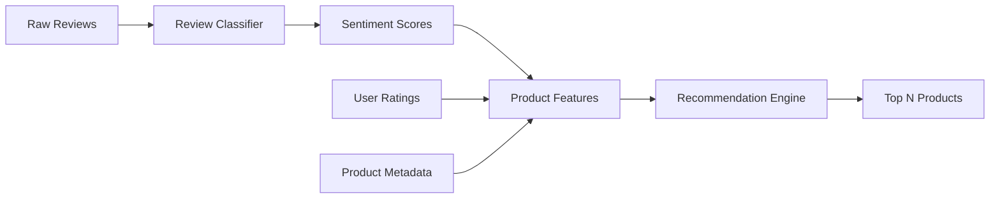
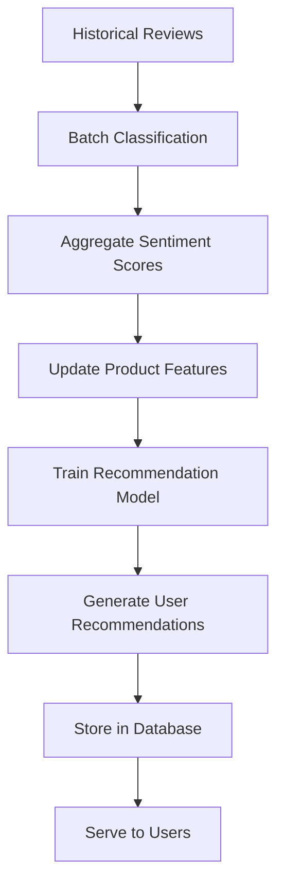
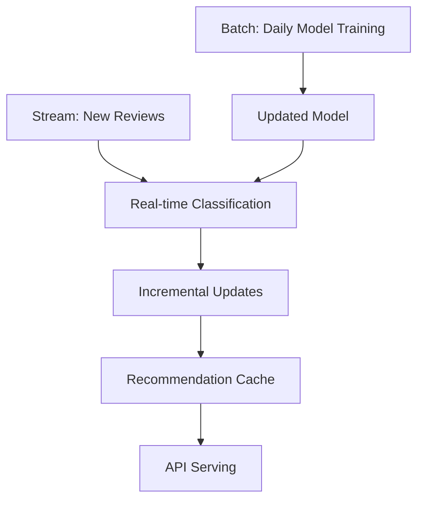

# Applying NLP Review Classifier & Product Recommendation Integration
**Big Data x AI Project - Production Application Guide**

## 📋 Table of Contents
1. [Applying Trained Model](#applying-trained-model)
2. [Integration with Recommendations](#integration-with-recommendations)
3. [Architecture Patterns](#architecture-patterns)
4. [Implementation Examples](#implementation-examples)

---

## 🎯 Part 1: Applying Trained Model

### **Step 1: Save Your Trained Model**

After training your pipeline, save it for reuse:

```python
# After training
pipeline = Pipeline(stages=[...])
model = pipeline.fit(train_data)

# Save the trained model
model.write().overwrite().save("/path/to/model/sentiment_classifier")
```

### **Step 2: Load the Model**

Load the pre-trained model in production:

```python
from pyspark.ml import PipelineModel

# Load saved model
loaded_model = PipelineModel.load("/path/to/model/sentiment_classifier")
```

### **Step 3: Apply to New Reviews (Batch)**

```python
# Load new reviews to classify
new_reviews = spark.read.csv("new_reviews.csv", header=True)

# Apply model - just transform, no fit needed!
predictions = loaded_model.transform(new_reviews)

# Show results
predictions.select("product_id", "review", "sentiment").show()
```

### **Step 4: Apply to Single Review (Real-time)**

```python
# Create DataFrame with single review
single_review = spark.createDataFrame([
    (1, "P123", "This product is amazing!")
], ["review_id", "product_id", "review"])

# Predict
result = loaded_model.transform(single_review)

# Extract sentiment
sentiment = result.select("sentiment").collect()[0][0]
print(f"Sentiment: {sentiment}")  # positive/negative/neutral
```

### **Step 5: Apply in Streaming Mode (Real-time)**

```python
from pyspark.sql.functions import from_json, col
from pyspark.sql.types import StructType, StringType

# Define schema for incoming data
schema = StructType() \
    .add("product_id", StringType()) \
    .add("user_id", StringType()) \
    .add("review", StringType())

# Read from Kafka stream
streaming_reviews = spark.readStream \
    .format("kafka") \
    .option("kafka.bootstrap.servers", "kafka:29092") \
    .option("subscribe", "reviews-raw") \
    .load()

# Parse JSON
parsed_reviews = streaming_reviews \
    .select(from_json(col("value").cast("string"), schema).alias("data")) \
    .select("data.*")

# Apply model to stream
classified_stream = loaded_model.transform(parsed_reviews)

# Write results
query = classified_stream \
    .writeStream \
    .format("kafka") \
    .option("kafka.bootstrap.servers", "kafka:29092") \
    .option("topic", "reviews-classified") \
    .option("checkpointLocation", "/tmp/checkpoint") \
    .start()
```

---

## 🔗 Part 2: Integration with Product Recommendation

### **Architecture Overview**



### **Integration Pattern 1: Sentiment-Based Filtering**

Filter products based on review sentiment before recommendation.

```python
# 1. Classify all reviews
classified_reviews = model.transform(all_reviews)

# 2. Aggregate sentiment by product
from pyspark.sql.functions import avg, count, when

product_sentiment = classified_reviews.groupBy("product_id").agg(
    count("*").alias("total_reviews"),
    count(when(col("sentiment") == "positive", 1)).alias("positive_count"),
    count(when(col("sentiment") == "negative", 1)).alias("negative_count"),
    count(when(col("sentiment") == "neutral", 1)).alias("neutral_count")
)

# 3. Calculate sentiment score (0-1)
product_sentiment = product_sentiment.withColumn(
    "sentiment_score",
    (col("positive_count") * 1.0 + col("neutral_count") * 0.5) / col("total_reviews")
)

# 4. Filter high-quality products
quality_products = product_sentiment.filter(
    (col("sentiment_score") > 0.6) & (col("total_reviews") >= 10)
)

# 5. Use in recommendation
# Only recommend from quality_products
```

### **Integration Pattern 2: Sentiment as Feature**

Use sentiment scores as features in recommendation algorithm.

```python
# Step 1: Calculate product sentiment features
product_features = classified_reviews.groupBy("product_id").agg(
    avg(when(col("sentiment") == "positive", 1.0)
        .when(col("sentiment") == "neutral", 0.5)
        .otherwise(0.0)).alias("avg_sentiment"),
    count("*").alias("review_count"),
    count(when(col("sentiment") == "positive", 1)).alias("positive_reviews")
)

# Step 2: Join with product catalog
from pyspark.sql.functions import coalesce

product_catalog = spark.read.csv("products.csv", header=True)
enriched_products = product_catalog.join(
    product_features,
    "product_id",
    "left"
).fillna({"avg_sentiment": 0.5, "review_count": 0})

# Step 3: Use in collaborative filtering
from pyspark.ml.recommendation import ALS

# Combine with ratings
user_ratings = spark.read.csv("ratings.csv", header=True)

# Train recommendation model
als = ALS(
    userCol="user_id",
    itemCol="product_id",
    ratingCol="rating",
    coldStartStrategy="drop"
)
rec_model = als.fit(user_ratings)

# Get recommendations
user_recs = rec_model.recommendForAllUsers(10)

# Step 4: Re-rank using sentiment
user_recs_exploded = user_recs.selectExpr(
    "user_id",
    "explode(recommendations) as rec"
).select("user_id", "rec.product_id", "rec.rating")

# Join with sentiment scores
final_recs = user_recs_exploded.join(
    enriched_products.select("product_id", "avg_sentiment", "review_count"),
    "product_id"
)

# Calculate final score combining ALS rating and sentiment
final_recs = final_recs.withColumn(
    "final_score",
    col("rating") * 0.7 + col("avg_sentiment") * 0.3
).orderBy(col("user_id"), col("final_score").desc())
```

### **Integration Pattern 3: Aspect-Based Recommendations**

Extract specific aspects from reviews (quality, price, shipping, etc.).

```python
# If you have aspect classification in your model
# classified_reviews has: product_id, aspect, sentiment

# Pivot to get aspect scores per product
from pyspark.sql.functions import pivot

aspect_scores = classified_reviews.groupBy("product_id").pivot("aspect").agg(
    avg(when(col("sentiment") == "positive", 1.0)
        .when(col("sentiment") == "neutral", 0.5)
        .otherwise(0.0))
)

# aspect_scores now has columns:
# product_id | quality_score | price_score | shipping_score | ...

# Match users with products based on their preferences
user_preferences = spark.read.csv("user_preferences.csv", header=True)
# user_id | prefers_quality | prefers_price | prefers_shipping

# Calculate personalized scores
from pyspark.sql.functions import lit

recommendations = aspect_scores.crossJoin(user_preferences)
recommendations = recommendations.withColumn(
    "personalized_score",
    col("quality_score") * col("prefers_quality") +
    col("price_score") * col("prefers_price") +
    col("shipping_score") * col("prefers_shipping")
).orderBy(col("user_id"), col("personalized_score").desc())
```

---

## 🏗️ Part 3: Complete Architecture Patterns

### **Pattern A: Offline Batch Processing**

Best for: Daily/weekly recommendation updates



**Workflow:**
```python
# 1. Nightly batch job
daily_reviews = spark.read.csv("reviews_today.csv", header=True)

# 2. Classify reviews
classified = model.transform(daily_reviews)

# 3. Update product sentiment table
classified.write.mode("append").saveAsTable("product_sentiments")

# 4. Recalculate aggregates
spark.sql("""
    CREATE OR REPLACE TABLE product_sentiment_agg AS
    SELECT 
        product_id,
        AVG(CASE 
            WHEN sentiment = 'positive' THEN 1.0
            WHEN sentiment = 'neutral' THEN 0.5
            ELSE 0.0
        END) as sentiment_score,
        COUNT(*) as review_count
    FROM product_sentiments
    GROUP BY product_id
""")

# 5. Retrain recommendation model
# 6. Generate recommendations for all users
# 7. Cache in Redis/Database for fast serving
```

### **Pattern B: Real-Time Streaming**

Best for: Immediate feedback, live recommendations


**Workflow:**
```python
# Continuous streaming job
streaming_reviews = spark.readStream \
    .format("kafka") \
    .option("kafka.bootstrap.servers", "kafka:29092") \
    .option("subscribe", "reviews-raw") \
    .load()

# Apply model
classified_stream = model.transform(streaming_reviews)

# Update aggregates in real-time
def update_product_score(batch_df, batch_id):
    # Update database with new sentiment data
    batch_df.write \
        .mode("append") \
        .jdbc(url, "product_sentiments", properties)
    
    # Trigger recommendation update for affected products
    affected_products = batch_df.select("product_id").distinct().collect()
    for product in affected_products:
        update_recommendations_for_product(product.product_id)

query = classified_stream.writeStream \
    .foreachBatch(update_product_score) \
    .start()
```

### **Pattern C: Hybrid (Batch + Real-Time)**

Best for: Balance between accuracy and latency



---

## 💻 Part 4: Complete Implementation Example

### **End-to-End Product Recommendation System**

```python
"""
Complete Review-Enhanced Product Recommendation System
"""

from pyspark.sql import SparkSession
from pyspark.ml import PipelineModel
from pyspark.ml.recommendation import ALS
from pyspark.sql.functions import *

class ReviewEnhancedRecommender:
    
    def __init__(self, spark, sentiment_model_path):
        self.spark = spark
        self.sentiment_model = PipelineModel.load(sentiment_model_path)
    
    def classify_reviews(self, reviews_df):
        """Apply sentiment classification to reviews"""
        return self.sentiment_model.transform(reviews_df)
    
    def calculate_product_sentiment_scores(self, classified_reviews):
        """Aggregate sentiment by product"""
        return classified_reviews.groupBy("product_id").agg(
            count("*").alias("review_count"),
            avg(when(col("sentiment") == "positive", 1.0)
                .when(col("sentiment") == "neutral", 0.5)
                .otherwise(0.0)).alias("sentiment_score"),
            count(when(col("sentiment") == "positive", 1)).alias("positive_count"),
            count(when(col("sentiment") == "negative", 1)).alias("negative_count")
        )
    
    def train_collaborative_filtering(self, ratings_df):
        """Train ALS recommendation model"""
        als = ALS(
            maxIter=10,
            regParam=0.1,
            userCol="user_id",
            itemCol="product_id",
            ratingCol="rating",
            coldStartStrategy="drop",
            nonnegative=True
        )
        return als.fit(ratings_df)
    
    def generate_recommendations(self, user_id, n=10):
        """Generate top N recommendations for a user"""
        
        # 1. Get collaborative filtering recommendations
        als_recs = self.als_model.recommendForAllUsers(n * 2)
        user_recs = als_recs.filter(col("user_id") == user_id)
        
        # 2. Explode recommendations
        exploded = user_recs.selectExpr(
            "user_id",
            "explode(recommendations) as rec"
        ).select(
            "user_id",
            "rec.product_id",
            "rec.rating"
        )
        
        # 3. Join with sentiment scores
        enriched = exploded.join(
            self.product_sentiments,
            "product_id"
        )
        
        # 4. Calculate final score
        final_recs = enriched.withColumn(
            "final_score",
            # Weighted combination
            col("rating") * 0.6 +                    # ALS rating importance
            col("sentiment_score") * 0.3 +           # Sentiment importance
            (col("review_count") / 100) * 0.1        # Popularity boost
        )
        
        # 5. Apply business rules
        final_recs = final_recs.filter(
            col("sentiment_score") > 0.4  # Don't recommend poorly reviewed products
        )
        
        # 6. Return top N
        return final_recs.orderBy(col("final_score").desc()).limit(n)
    
    def explain_recommendation(self, user_id, product_id):
        """Explain why a product was recommended"""
        
        # Get product details
        product = self.product_sentiments.filter(
            col("product_id") == product_id
        ).first()
        
        explanation = {
            "product_id": product_id,
            "sentiment_score": product.sentiment_score,
            "review_count": product.review_count,
            "positive_reviews": product.positive_count,
            "negative_reviews": product.negative_count,
            "recommendation": ""
        }
        
        # Generate natural language explanation
        if product.sentiment_score > 0.8:
            explanation["recommendation"] = \
                f"Highly recommended! {product.positive_count} customers loved it."
        elif product.sentiment_score > 0.6:
            explanation["recommendation"] = \
                f"Good choice! {product.positive_count} positive reviews."
        else:
            explanation["recommendation"] = \
                f"Mixed reviews. {product.review_count} total reviews."
        
        return explanation


# Usage Example
if __name__ == "__main__":
    
    # Initialize
    spark = SparkSession.builder.appName("RecommendationSystem").getOrCreate()
    recommender = ReviewEnhancedRecommender(
        spark,
        sentiment_model_path="/models/sentiment_classifier"
    )
    
    # 1. Load and classify reviews
    reviews = spark.read.csv("reviews.csv", header=True)
    classified_reviews = recommender.classify_reviews(reviews)
    
    # 2. Calculate product sentiment
    product_sentiments = recommender.calculate_product_sentiment_scores(classified_reviews)
    recommender.product_sentiments = product_sentiments
    
    # 3. Train recommendation model
    ratings = spark.read.csv("ratings.csv", header=True)
    recommender.als_model = recommender.train_collaborative_filtering(ratings)
    
    # 4. Generate recommendations
    user_recommendations = recommender.generate_recommendations(user_id="U123", n=10)
    user_recommendations.show()
    
    # 5. Explain recommendations
    for rec in user_recommendations.collect():
        explanation = recommender.explain_recommendation("U123", rec.product_id)
        print(explanation)
```

---

## 📊 Part 5: Metrics & Monitoring

### **Track Model Performance**

```python
# Monitor sentiment classification accuracy
def monitor_classification_quality(classified_reviews):
    """Track classification metrics over time"""
    
    metrics = classified_reviews.groupBy("date").agg(
        count("*").alias("total_classified"),
        avg(col("confidence")).alias("avg_confidence"),
        countDistinct("product_id").alias("unique_products")
    )
    
    # Alert if confidence drops
    low_confidence = metrics.filter(col("avg_confidence") < 0.7)
    if low_confidence.count() > 0:
        print("WARNING: Low classification confidence detected!")
    
    return metrics

# Monitor recommendation performance
def monitor_recommendation_quality(recommendations, user_clicks):
    """Track recommendation effectiveness"""
    
    # Join recommendations with actual user clicks
    performance = recommendations.join(
        user_clicks,
        ["user_id", "product_id"],
        "left"
    )
    
    # Calculate CTR (Click-Through Rate)
    ctr = performance.agg(
        (count(when(col("clicked") == True, 1)) / count("*")).alias("ctr")
    ).first().ctr
    
    print(f"Recommendation CTR: {ctr:.2%}")
    return ctr
```

---

## 🚀 Deployment Checklist

- [ ] Train and validate sentiment classification model
- [ ] Save model to persistent storage
- [ ] Set up model loading in production
- [ ] Process historical reviews (batch)
- [ ] Calculate product sentiment scores
- [ ] Train recommendation model (ALS/other)
- [ ] Implement scoring/ranking logic
- [ ] Set up streaming pipeline (if needed)
- [ ] Create API endpoints for serving
- [ ] Add monitoring and logging
- [ ] Test end-to-end flow
- [ ] Deploy to production

---

## 🔧 Advanced Enhancements

1. **Time-Decay**: Weight recent reviews more heavily
2. **User Preferences**: Factor in user's past sentiment patterns
3. **Category-Specific**: Different models per product category
4. **Multi-Language**: Support reviews in multiple languages
5. **Aspect Mining**: Extract specific product aspects (quality, price, delivery)
6. **Fake Review Detection**: Filter out suspicious reviews
7. **Trending Products**: Boost products with recent positive buzz

---

**Good luck with your implementation!** 🎯
