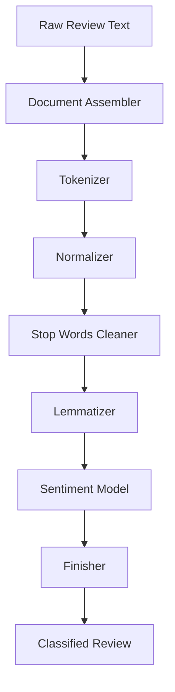

# Reviews Classification Pipeline Guide
**Big Data x AI Project - Reference Architecture**

## 🏗️ Pipeline Architecture Overview



## 📋 Pipeline Stages Breakdown

### **Stage 1: Document Assembler**
- **Purpose**: Convert raw text to Spark-NLP document format
- **Input**: Column with review text (String)
- **Output**: Document annotation
- **Spark-NLP Component**: `DocumentAssembler`

```python
# Example structure
.setInputCol("review")
.setOutputCol("document")
```

---

### **Stage 2: Tokenization**
- **Purpose**: Split text into individual tokens/words
- **Input**: Document annotation
- **Output**: Token annotations
- **Spark-NLP Component**: `Tokenizer` or `RegexTokenizer`

```python
# What it does
"Great product!" → ["Great", "product", "!"]
```

---

### **Stage 3: Normalization**
- **Purpose**: Clean and standardize tokens
- **Tasks**:
  - Convert to lowercase
  - Remove special characters
  - Remove punctuation
- **Input**: Token annotations
- **Output**: Normalized token annotations
- **Spark-NLP Component**: `Normalizer`

```python
# What it does
["Great", "product", "!"] → ["great", "product"]
```

---

### **Stage 4: Stop Words Removal**
- **Purpose**: Remove common words that don't contribute to sentiment
- **Examples**: "the", "is", "at", "which", "on"
- **Input**: Normalized tokens
- **Output**: Clean tokens
- **Spark-NLP Component**: `StopWordsCleaner`

```python
# What it does
["this", "is", "great", "product"] → ["great", "product"]
```

---

### **Stage 5: Lemmatization** (Optional but Recommended)
- **Purpose**: Reduce words to their base/root form
- **Input**: Clean tokens
- **Output**: Lemmatized tokens
- **Spark-NLP Component**: `Lemmatizer`

```python
# What it does
["running", "ran", "runs"] → ["run", "run", "run"]
["better", "best"] → ["good", "good"]
```

---

### **Stage 6: Sentiment Detection**
- **Purpose**: Classify the sentiment of the text
- **Input**: Processed tokens + document
- **Output**: Sentiment label (positive/negative/neutral)
- **Spark-NLP Components** (choose one):

#### **Option A: ViveknSentiment** (Rule-Based)
- Faster, lightweight
- Good for real-time processing
- Pre-trained model available
- Component: `ViveknSentimentModel.pretrained()`

#### **Option B: ClassifierDL** (Deep Learning)
- Higher accuracy
- Uses Universal Sentence Encoder
- Better context understanding
- Component: `ClassifierDLModel.pretrained("classifierdl_use_sentiment")`

#### **Option C: SentimentDL** (Advanced DL)
- State-of-the-art accuracy
- Requires embeddings
- Component: `SentimentDLModel.pretrained()`

---

### **Stage 7: Finisher**
- **Purpose**: Convert Spark-NLP annotations back to readable format
- **Input**: Sentiment annotations
- **Output**: Simple string/array columns
- **Spark-NLP Component**: `Finisher`

```python
# What it does
Annotation[sentiment] → "positive" (readable string)
```

---

## 🔧 Implementation Steps

### **Step 1: Setup Spark Session**
```python
# Initialize Spark with Spark-NLP
import sparknlp
spark = sparknlp.start()

# OR manually configure
from pyspark.sql import SparkSession
spark = SparkSession.builder \
    .appName("ReviewsClassification") \
    .config("spark.jars.packages", "com.johnsnowlabs.nlp:spark-nlp_2.12:5.1.4") \
    .getOrCreate()
```

### **Step 2: Load Data**
```python
# Load reviews from CSV/JSON/Parquet
df = spark.read.csv("path/to/reviews.csv", header=True)
```

### **Step 3: Build Pipeline**
```python
from pyspark.ml import Pipeline
from sparknlp.base import *
from sparknlp.annotator import *

# Create all stages (see components above)
stage1 = DocumentAssembler()...
stage2 = Tokenizer()...
# ... etc

# Combine into pipeline
pipeline = Pipeline(stages=[stage1, stage2, stage3, ...])
```

### **Step 4: Fit & Transform**
```python
# Fit the pipeline (download models if needed)
model = pipeline.fit(df)

# Transform data (make predictions)
predictions = model.transform(df)
```

### **Step 5: Evaluate**
```python
# Show results
predictions.select("review", "sentiment_result").show()

# Calculate metrics
from pyspark.ml.evaluation import MulticlassClassificationEvaluator
evaluator = MulticlassClassificationEvaluator(...)
accuracy = evaluator.evaluate(predictions)
```

---

## 📦 Required Imports

```python
# PySpark Core
from pyspark.sql import SparkSession
from pyspark.ml import Pipeline, PipelineModel
from pyspark.ml.evaluation import MulticlassClassificationEvaluator

# Spark-NLP Base
import sparknlp
from sparknlp.base import DocumentAssembler, Finisher

# Spark-NLP Annotators
from sparknlp.annotator import (
    Tokenizer,
    Normalizer,
    StopWordsCleaner,
    Lemmatizer,
    ViveknSentimentModel,
    ClassifierDLModel,
    UniversalSentenceEncoder
)
```

---

## 🎯 Pipeline Configurations

### **Minimal Pipeline** (Fastest)
1. DocumentAssembler
2. Tokenizer
3. ViveknSentimentModel (pre-trained)
4. Finisher

### **Standard Pipeline** (Balanced)
1. DocumentAssembler
2. Tokenizer
3. Normalizer
4. StopWordsCleaner
5. ViveknSentimentModel (pre-trained)
6. Finisher

### **Advanced Pipeline** (Most Accurate)
1. DocumentAssembler
2. Tokenizer
3. Normalizer
4. StopWordsCleaner
5. Lemmatizer
6. UniversalSentenceEncoder (embeddings)
7. ClassifierDLModel (pre-trained DL)
8. Finisher

---

## 📚 Key Resources

### **Official Documentation**
- Spark-NLP: https://nlp.johnsnowlabs.com/docs/en/quickstart
- PySpark ML: https://spark.apache.org/docs/latest/ml-guide.html
- Spark-NLP Models: https://nlp.johnsnowlabs.com/models

### **Pre-trained Models**
- `vivekn_sentiment` - Rule-based sentiment
- `classifierdl_use_sentiment` - DL sentiment with USE
- `sentimentdl_use_twitter` - Twitter sentiment
- `tfhub_use` - Universal Sentence Encoder

### **Useful Tutorials**
- Spark-NLP Workshop: https://github.com/JohnSnowLabs/spark-nlp-workshop
- Sentiment Analysis Examples: `/tutorials/Certification_Trainings/Public/`

---

## 💡 Key Concepts to Research

1. **Spark ML Pipelines**
   - How to chain transformers and estimators
   - Difference between `fit()` and `transform()`
   - Pipeline persistence (save/load)

2. **Spark-NLP Annotators**
   - What are annotations vs columns
   - How annotators chain together
   - Input/output column management

3. **Pre-trained Models**
   - How to download and use `.pretrained()`
   - Model compatibility with Spark-NLP versions
   - Language support

4. **Evaluation Metrics**
   - Accuracy, Precision, Recall, F1-Score
   - Confusion Matrix
   - Multi-class vs Binary classification

---

## 🔍 Things to Explore

### **Advanced Features**
- N-gram generation for better context
- Custom word embeddings (Word2Vec, BERT)
- Multi-lingual sentiment analysis
- Fine-tuning pre-trained models
- Streaming integration with Kafka

### **Performance Optimization**
- Caching intermediate results
- Repartitioning data
- Broadcast joins
- Model pipeline optimization

### **Production Deployment**
- Model versioning
- A/B testing different models
- Real-time serving
- Monitoring and logging

---

## 📝 Sample Code Structure

```python
# 1. Initialize
spark = sparknlp.start()

# 2. Load data
df = spark.read.csv("reviews.csv", header=True)

# 3. Build pipeline
document = DocumentAssembler().setInputCol("text").setOutputCol("document")
tokenizer = Tokenizer().setInputCols(["document"]).setOutputCol("token")
sentiment = ViveknSentimentModel.pretrained().setInputCols(["document", "token"]).setOutputCol("sentiment")
finisher = Finisher().setInputCols(["sentiment"]).setOutputCols(["result"])

pipeline = Pipeline(stages=[document, tokenizer, sentiment, finisher])

# 4. Train & predict
model = pipeline.fit(df)
predictions = model.transform(df)

# 5. Show results
predictions.select("text", "result").show()
```

---

## ✅ Implementation Checklist

- [ ] Set up Spark session with Spark-NLP package
- [ ] Load or create sample review data
- [ ] Create DocumentAssembler stage
- [ ] Add Tokenizer stage
- [ ] Add Normalizer stage (optional)
- [ ] Add StopWordsCleaner stage (optional)
- [ ] Add Lemmatizer stage (optional)
- [ ] Add pre-trained Sentiment model
- [ ] Add Finisher stage
- [ ] Combine stages into Pipeline
- [ ] Fit pipeline on data
- [ ] Transform data (make predictions)
- [ ] Evaluate results
- [ ] Save model (optional)

---

Good luck with your implementation! 🚀
