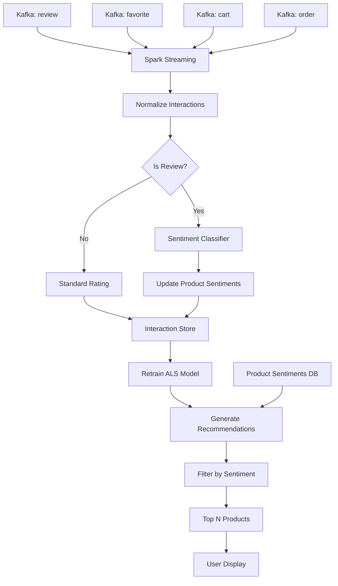

# Streaming Integration Guide
**Integrating Review Classification with Real-Time Recommendations**

## 🏗️ Architecture Overview



## 🔄 Integration Flow

### **1. Data Ingestion**

Four Kafka topics stream into Spark:
- `review` - User reviews with comments and ratings
- `favorite` - User favorites (implicit rating: 4.0)
- `cart` - Cart additions (implicit rating: 3.0)
- `order` - Purchases (implicit rating: 5.0)

### **2. Review Processing**

```python
# When review arrives
review = {
    "userId": "U123",
    "itemId": "P456", 
    "comment": "Great product!",
    "rating": 5.0
}

# Step 1: Apply sentiment classifier
sentiment = model.transform(review["comment"])
# Result: "positive" → sentiment_score = 1.0

# Step 2: Update product aggregate
product_sentiments[P456] = {
    "avg_sentiment": 0.85,
    "review_count": 47,
    "positive_count": 40,
    "negative_count": 3
}
```

### **3. Interaction Normalization**

All interactions converted to common format:

```python
normalized = {
    "userId": int,
    "itemId": int,
    "rating": float,
    "timestamp": long,
    "interaction_type": string
}
```

### **4. Recommendation Generation**

```python
# Step 1: ALS generates candidates
als_recs = model.recommendForUser(user_id, 15)
# Returns: [(P1, 4.5), (P2, 4.3), (P3, 4.1), ...]

# Step 2: Join with sentiment scores
enriched = als_recs.join(product_sentiments)
# Now has: itemId, als_rating, avg_sentiment, review_count

# Step 3: Calculate final score
final_score = (
    als_rating * 0.6 +
    avg_sentiment * 0.3 +
    (review_count / 100) * 0.1
)

# Step 4: Filter poor products
filtered = enriched.filter(avg_sentiment > 0.4)

# Step 5: Return top N
final_recs = filtered.orderBy(final_score.desc()).limit(5)
```

## 📋 Key Differences from Original

### **Original `streaming.py`**
```python
class RealTimeRecommender:
    - Only uses ALS collaborative filtering
    - No sentiment analysis
    - Recommendations based solely on user-item interactions
    - No quality filtering
```

### **Enhanced `streaming_with_sentiment.py`**
```python
class SentimentEnhancedRecommender:
    ✅ Loads and applies sentiment classification model
    ✅ Analyzes review comments in real-time
    ✅ Maintains product sentiment scores
    ✅ Combines ALS + sentiment for final ranking
    ✅ Filters out poorly-reviewed products
    ✅ Displays sentiment info with recommendations
```

## 🔧 Implementation Components

### **Component 1: Sentiment Model Integration**

```python
# Load pre-trained sentiment model
self.sentiment_model = PipelineModel.load(
    "/opt/spark-data/models/sentiment_classifier"
)

# Apply to incoming reviews
def classify_review_sentiment(self, review_text):
    review_df = spark.createDataFrame([(review_text,)], ["review"])
    result = self.sentiment_model.transform(review_df)
    sentiment = result.select("sentiment_result").first()[0]
    
    # Map to score: positive=1.0, neutral=0.5, negative=0.0
    return sentiment_to_score(sentiment)
```

### **Component 2: Product Sentiment Tracking**

```python
# Aggregate sentiments by product
product_sentiments = reviews.groupBy("itemId").agg(
    avg("sentiment_score").alias("avg_sentiment"),
    count("*").alias("review_count"),
    count(when(col("sentiment_score") >= 0.7, 1)).alias("positive_count"),
    count(when(col("sentiment_score") <= 0.3, 1)).alias("negative_count")
)

# Update incrementally as new reviews arrive
def update_product_sentiments(self, new_reviews):
    # Classify new reviews
    classified = self.sentiment_model.transform(new_reviews)
    
    # Merge with existing sentiments
    self.product_sentiments = combine_and_reaggregate(
        old_sentiments,
        new_sentiments
    )
```

### **Component 3: Weighted Recommendation Scoring**

```python
# Combine multiple signals
final_score = (
    als_rating * 0.6 +        # Collaborative filtering strength
    avg_sentiment * 0.3 +     # Product quality from reviews
    (review_count / 100) * 0.1  # Popularity bias
)

# Customize weights based on your needs:
# - More weight on sentiment → Better quality products
# - More weight on ALS → Better personalization
# - More weight on popularity → Trending products
```

### **Component 4: Quality Filtering**

```python
# Filter recommendations
filtered_recs = recs.filter(
    # Option A: Minimum sentiment threshold
    (col("avg_sentiment") > 0.4) |
    
    # Option B: Insufficient reviews (give benefit of doubt)
    (col("review_count") < 5)
)

# This ensures:
# - Products with many negative reviews are excluded
# - New products without reviews still get recommended
# - Only quality products go to users
```

## 📊 Real-Time Processing Flow

### **Batch Processing Cycle (Every 30 seconds)**

```python
def process_batch(batch_df, batch_id):
    # 1. Identify reviews in batch
    reviews = batch_df.filter(interaction_type == "review")
    
    # 2. Classify review sentiments
    if not reviews.isEmpty():
        update_product_sentiments(reviews)
    
    # 3. Add all interactions to history
    all_interactions.append(batch_df)
    
    # 4. Retrain if interval passed (every 5 minutes)
    if should_retrain():
        train_model(all_interactions)
        
        # 5. Generate recommendations for active users
        for user in batch_df.select("userId").distinct():
            recs = generate_recommendations(user, 5)
            display_recommendations(user, recs)
```

### **Timeline Example**

```
00:00 - Review arrives: "Great product!" for P123
00:01 - Sentiment classified: positive (1.0)
00:02 - P123 sentiment updated: 0.82 → 0.83
00:30 - Batch processed, interactions stored
05:00 - Model retrained with new data
05:01 - Recommendations generated
      - P123 now ranked higher due to positive review
      - Product P456 ranked lower (poor sentiment)
      - User sees updated recommendations
```

## 🎯 Usage Examples

### **Example 1: Basic Setup**

```python
# Initialize with sentiment model
recommender = SentimentEnhancedRecommender(
    spark,
    sentiment_model_path="/opt/spark-data/models/sentiment_classifier"
)

# Process streams
for topic, schema in topics.items():
    df = read_kafka_stream(topic, schema)
    normalized = recommender.normalize_interaction(df, topic)
    
    query = normalized.writeStream \
        .foreachBatch(process_batch) \
        .start()
```

### **Example 2: Custom Scoring Weights**

```python
# Adjust in generate_recommendations()
final_score = (
    col("als_rating") * 0.5 +       # Reduce ALS weight
    col("avg_sentiment") * 0.4 +    # Increase sentiment weight
    (col("review_count") / 100) * 0.1
)

# Result: Prioritizes quality over collaborative patterns
```

### **Example 3: Stricter Filtering**

```python
# Only recommend highly-rated products
filtered = enriched.filter(
    (col("avg_sentiment") > 0.7) &   # Must be positive
    (col("review_count") >= 10)      # Must have enough reviews
)

# Result: Higher quality recommendations, but fewer options
```

## 🔍 Monitoring & Debugging

### **Check Sentiment Coverage**

```python
# How many products have sentiment data?
coverage = product_sentiments.count() / total_products.count()
print(f"Sentiment coverage: {coverage:.1%}")

# Which products lack reviews?
unreviewed = all_products.join(
    product_sentiments,
    "itemId",
    "left_anti"  # Products NOT in sentiments
)
```

### **Monitor Sentiment Distribution**

```python
# Distribution of product sentiments
sentiment_dist = product_sentiments.groupBy(
    when(col("avg_sentiment") > 0.6, "Positive")
    .when(col("avg_sentiment") > 0.4, "Neutral")
    .otherwise("Negative")
    .alias("category")
).count()

sentiment_dist.show()
# +----------+-----+
# | category |count|
# +----------+-----+
# | Positive | 450 |
# | Neutral  | 120 |
# | Negative |  30 |
# +----------+-----+
```

### **Track Filtering Impact**

```python
# Before filtering
unfiltered_count = als_recommendations.count()

# After filtering
filtered_count = sentiment_filtered_recommendations.count()

filter_rate = 1 - (filtered_count / unfiltered_count)
print(f"Filtered out: {filter_rate:.1%} of recommendations")
```

## 🚀 Deployment Steps

1. **Train sentiment model** (see PIPELINE_GUIDE.md)
2. **Save model** to shared storage
3. **Update model path** in streaming script
4. **Deploy to Spark cluster**:
   ```bash
   docker exec -it spark-master spark-submit \
     --master spark://spark-master:7077 \
     --packages com.johnsnowlabs.nlp:spark-nlp_2.12:5.1.4 \
     /opt/spark-apps/streaming_with_sentiment.py
   ```
5. **Monitor logs** for sentiment classification
6. **Test recommendations** quality

## 📈 Performance Optimization

### **Batch Sentiment Classification**

Instead of one-by-one:
```python
# ✅ GOOD: Batch processing
all_reviews = batch_df.filter(col("comment").isNotNull())
classified = sentiment_model.transform(all_reviews)
```

Not:
```python
# ❌ SLOW: One at a time
for review in batch_df.collect():
    classify_review_sentiment(review.comment)
```

### **Cache Frequently Accessed Data**

```python
# Cache product sentiments
self.product_sentiments.cache()

# Cache user interactions
self.all_interactions.cache()
```

### **Optimize Joins**

```python
# Broadcast small tables
from pyspark.sql.functions import broadcast

enriched = recs.join(
    broadcast(product_sentiments),  # Broadcast if < 10MB
    "itemId"
)
```

## 🎓 Learning Resources

- **Streaming Guide**: [Spark Structured Streaming](https://spark.apache.org/docs/latest/structured-streaming-programming-guide.html)
- **Kafka Integration**: [Spark Kafka Integration](https://spark.apache.org/docs/latest/structured-streaming-kafka-integration.html)
- **Model Serving**: [ML Pipeline Persistence](https://spark.apache.org/docs/latest/ml-pipeline.html#ml-persistence-saving-and-loading-pipelines)

---

**Great job integrating sentiment into your recommendation system!** 🎉
